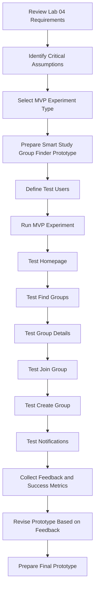

```mermaid
flowchart TD

A[Review Lab 04 Requirements]
--> B[Identify Critical Assumptions]

B --> C[Select MVP Experiment Type]

C --> D[Prepare Smart Study Group Finder Prototype]

D --> E[Define Test Users]

E --> F[Run MVP Experiment]

F --> G[Test Homepage]

G --> H[Test Find Groups]

H --> I[Test Group Details]

I --> J[Test Join Group]

J --> K[Test Create Group]

K --> L[Test Notifications]

L --> M[Collect Feedback and Success Metrics]

M --> N[Revise Prototype Based on Feedback]

N --> O[Prepare Final Prototype]
```
