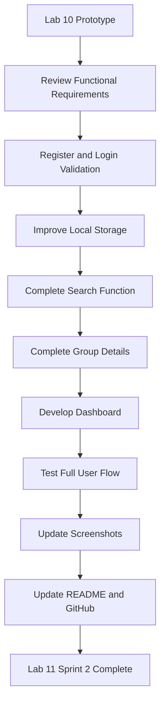

```mermaid
flowchart TD

A[Lab 10 Prototype]
A --> B[Review Functional Requirements]

B --> C[Register and Login Validation]

C --> D[Improve Local Storage]

D --> E[Complete Search Function]

E --> F[Complete Group Details]

F --> G[Develop Dashboard]

G --> H[Test Full User Flow]

H --> I[Update Screenshots]

I --> J[Update README and GitHub]

J --> K[Lab 11 Sprint 2 Complete]
```
