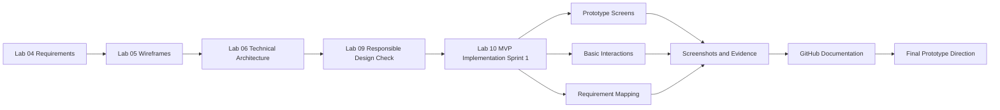

```mermaid
flowchart LR

A[Lab 04 Requirements]
A --> B[Lab 05 Wireframes]

B --> C[Lab 06 Technical Architecture]

C --> D[Lab 09 Responsible Design Check]

D --> E[Lab 10 MVP Implementation Sprint 1]

E --> F[Prototype Screens]

E --> G[Basic Interactions]

E --> H[Requirement Mapping]

F --> I[Screenshots and Evidence]

G --> I

H --> I

I --> J[GitHub Documentation]

J --> K[Final Prototype Direction]
```
