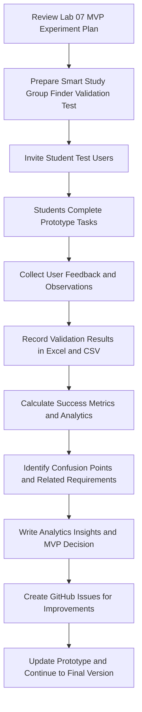

```mermaid
flowchart TD

A[Review Lab 07 MVP Experiment Plan]
--> B[Prepare Smart Study Group Finder Validation Test]

B --> C[Invite Student Test Users]

C --> D[Students Complete Prototype Tasks]

D --> E[Collect User Feedback and Observations]

E --> F[Record Validation Results in Excel and CSV]

F --> G[Calculate Success Metrics and Analytics]

G --> H[Identify Confusion Points and Related Requirements]

H --> I[Write Analytics Insights and MVP Decision]

I --> J[Create GitHub Issues for Improvements]

J --> K[Update Prototype and Continue to Final Version]
```
